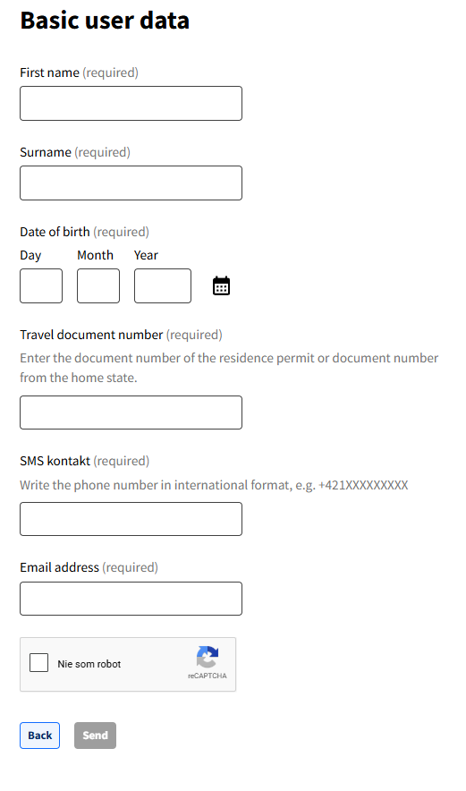
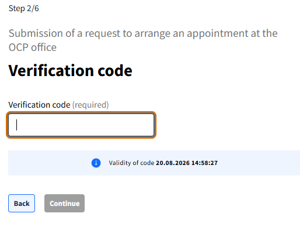
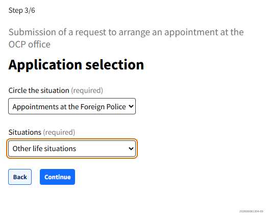
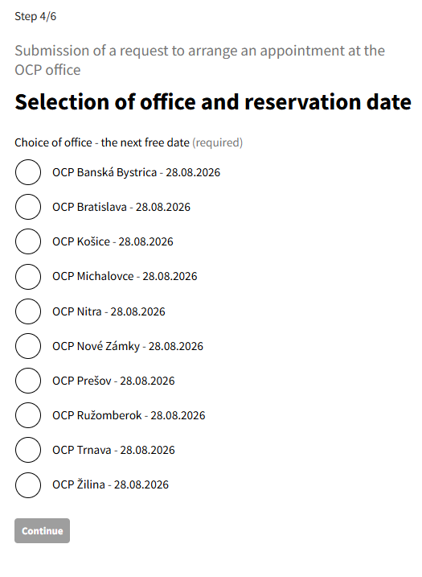
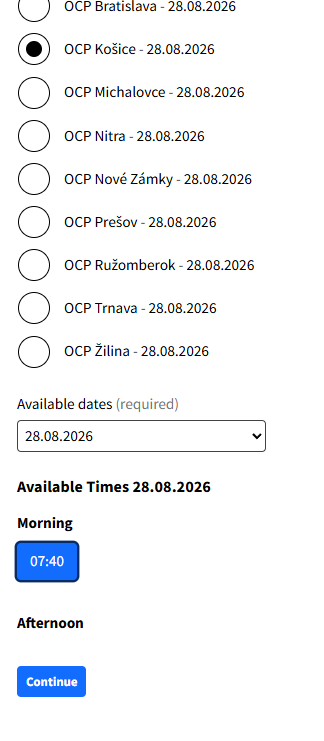

# How to book an appointment at the foreign police

It is necessary to book an appointment at the foreign police. Below is the step-by-step procedure.

## General notes

- You need to be physically in Slovakia in order to do the booking.
- You need to use a Slovak SIM card to make the reservation.
- If you want to change the date and place of your booking, do not forget to cancel the previous reservation (otherwise you risk being blocked by the foreign police).
- You can submit at any foreign police office in Slovakia.
- You can book a slot even if you do not have your documents ready now, as long as you will have them ready on submission day.
- Contact your coordinator to translate your PCC (police clearance certificate).
- Visit the study office to collect your enrollment letter.
- You can generate the TRP form at [rpform.studyinslovakia.sk](https://rpform.studyinslovakia.sk).

## Booking online — step by step

**1. Open the foreign police portal**

Go to the [foreign police booking portal](https://portal.minv.sk/wps/portal/domov/ecu/ecu_elektronicke_sluzby/ecu-vysys/!ut/p/a1/pZJNDoIwEEbP4gn6tZZCl60_bVEkqERlY1gZEkUXxvMLRBdorCbObpL3ZjozJQXZkqIub9WhvFbnujy2eSH2HKOJjWeIjVRDZEIzFaQpAN4AuwbAh1Do-1gGU2TUWJ0YMHD28D1Az4_suik6mwZWZoshDH3134GenyZUQOXJWiuZM5jn-0dGWR7O24kiBjfWdhzKBHDit_k9Df7yEfzpf-2_IUWHUMYc1asGiTIJZZwI2URTRPQL4PAAfDvsAN8n8Z6p3YIf4ORyyrvYonKVU4M7UEEQug!!/dl5/d5/L0lDUmlTUSEhL3dHa0FKRnNBLzRKVXBDQSEhL2Vu/). You can switch the language to English.

**2. Fill in your personal details**

Use your Slovak number for booking, otherwise you will not get the confirmation text message. You must be physically in Slovakia to access the form.

{ width="560" }

{ width="560" }

{ width="560" }

**3. Choose the appointment type**

Select **Appointments at the Foreign Police** and then **Other life situation**.

{ width="560" }

**4. Pick an available slot**

You will see the slots that are available. You can select any available slot — choose the city, day and exact time.

{ width="560" }

**5. Confirm and submit**

Confirm your personal details and submit. You will get a confirmation by email.
